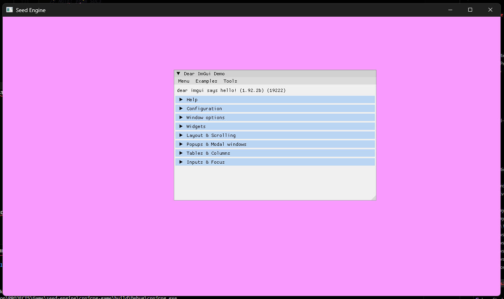
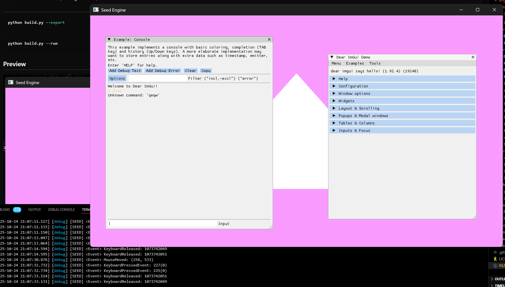

# Seed

A random game engine

## Dependency

1. [Conan](https://docs.conan.io/2.0/reference/commands/install.html)
2. [CMake]()
3. [Raylib](https://www.raylib.com/)
4. [Flecs](https://www.flecs.dev/)
5. [SpdLog](https://github.com/gabime/spdlog)
6. [DirectX11](https://www.rastertek.com/tutdx11win10.html)
7. [SDL3](https://wiki.libsdl.org/SDL3/CategoryAPI)

## Installation Seed Engine

1. Clone

    ```shell
    git clone 
    ```

2. `cd engine`

3. Install

    ```shell
    conan install --profile ..\tools\conanprofiles\win_msvc_194 --build=missing -s build_type=Debug .
    ```

4. Build

    ```shell
    conan build --profile ..\tools\conanprofiles\win_msvc_194 --build=missing -s build_type=Debug .
    ```

5. Export the lib

    ```shell
    conan export-pkg --profile ..\tools\conanprofiles\win_msvc_194 -s build_type=Debug .
    ```

6. Now you can use the header files and lib for developing your game! You just need to include it as conan depedencies or grab those files manually

7. To delete the exported packaged

    ```shell
    conan remove seed/1.0.0@mhnaufal/stable
    ```

---

```shell
python build.py --export
```

```shell
python build.py --run
```

## Preview




